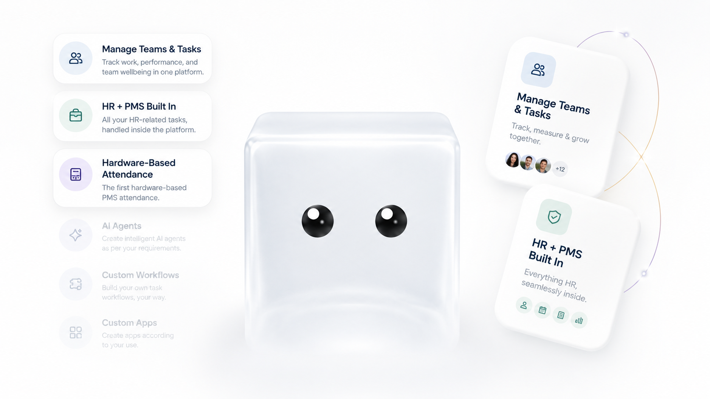

<p align="center">
  <a href="https://cubes.im">
    
  </a>
</p>

<h1 align="center">Cubes</h1>

<p align="center">
  🧊 <strong>One login. Zero glue work.</strong>
</p>

<p align="center">
  The open-source all-in-one workspace for agencies and business owners —<br />
  project management, video review, client portals, and social publishing in one place.
</p>

<p align="center">
  
  
  
  
</p>

<p align="center">
  <a href="#-features">Features</a> ·
  <a href="#-built-in-apps">Built-in apps</a> ·
  <a href="#-getting-started">Getting started</a> ·
  <a href="#-self-hosting">Self-hosting</a> ·
  <a href="#-tech-stack">Tech stack</a> ·
  <a href="#-docs">Docs</a>
</p>

<p align="center">
  
</p>

---

## Why Cubes?

Agencies run on five subscriptions duct-taped together: a PM tool, a video-review
tool, a client-portal tool, a social scheduler, and a file locker. Cubes replaces
the stack with **one workspace and one login** — and prices it honestly:

- **Self-hosted** — free forever, unlimited seats. It's open source.
- **Cloud** — one flat monthly price for **unlimited team members**; you only pay
  for the storage you use. No per-seat charges, ever.

## ✨ Features

**Projects & tasks**

- Multiple views over the same tasks — **List, Board, Timeline (Gantt), Calendar, Table, Workload** — switchable per project with a customizable tab strip
- Task drawer with subtasks, comments, dependencies, labels, attachments, time tracking, and inline `@`-mentions everywhere
- **My Tasks** with inline editing, project **Overview** dashboards, and a project-wide **Activity** feed
- Custom **Task-ID rules** (e.g. `WEB-142`), task & project **templates**, recurring tasks
- **Spaces** — organize projects into folders with favorites, sharing, and per-project privacy

**Team & operations**

- **Schedule** — team-wide resource allocation calendar
- **Workflows** — a visual automation builder plus deterministic, no-credit **Agents**
- **Reporting** — projects, members, and time-sheet analytics
- **HR module** — employees, org chart, attendance, leave, payroll, onboarding, letters & documents
- **Admin center** — users, teams, billing, activity logs, and platform pricing controls

**Platform**

- Realtime sync (Supabase Realtime) — boards and lists update live across the team
- Background uploads with live progress, notification inbox with assigned-comment tracking
- Optional AI assists (task breakdown, standup summaries) — bring your own API key
- Light & dark themes, mobile-friendly shell

## 🧩 Built-in apps

One login, installable per workspace from the **App Center**:

| App | What it does |
| --- | --- |
| 🎬 **Video Review** | Upload cuts, timestamped comments, versions, and approvals |
| 🤝 **Client Portal** | Token-gated public portal — clients see progress, reviews, and billing, and submit work requests. **No client login needed.** 5 portal templates including a live sheet view |
| 📣 **Social Studio** | Plan and schedule posts across your social channels |
| 📁 **Files** | Shared file management across projects and teams |
| 📄 **Docs** | Project docs — a page tree with per-page privacy |

## 🚀 Getting started

**Prerequisites:** Node.js 20+, a [Supabase](https://supabase.com) project (or the local Supabase CLI stack).

```bash
# 1. Install
npm install

# 2. Configure — fill in your Supabase creds
cp .env.example .env.local

# 3. Apply the database schema (48+ tables, RLS-first)
npm run db:push

# 4. Run
npm run dev
```

Open http://localhost:3000 — logged-out visitors land on the marketing site,
authenticated users go to `/home`.

**Optional — seed a demo workspace** (5 users, projects, tasks, HR data):

```bash
node scripts/seed-demo.mjs      # then log in as demo@cubes.test / Demo1234!
```

### Environment

| Key | Scope | Purpose |
| --- | --- | --- |
| `NEXT_PUBLIC_SUPABASE_URL` | browser | Supabase project URL |
| `NEXT_PUBLIC_SUPABASE_ANON_KEY` | browser | Supabase anon key |
| `SUPABASE_SERVICE_ROLE_KEY` | server only | Admin operations (account deletion, seeding) |
| `SUPABASE_DB_URL` | server only | Migrations |
| `ANTHROPIC_API_KEY` | server only, optional | AI features (`/api/ai/*`) — without it the AI buttons return a friendly "not configured" error |
| `OPENROUTER_API_KEY` | server only, optional | Agent playground (`/api/workflows/agents/run`) |

## 🏠 Self-hosting

Cubes is a standard Next.js + Supabase app — if you can run those, you can run Cubes:

1. Stand up Postgres via [Supabase self-hosted](https://supabase.com/docs/guides/self-hosting) or a managed Supabase project
2. `npm run db:push` to apply migrations, then load `supabase/seed.sql` (lookup data)
3. `npm run build && npm run start` behind your reverse proxy

Unlimited seats, no meters, no strings.

## 🛠 Tech stack

| Concern | Choice |
| --- | --- |
| Framework | Next.js 16 (App Router, `src/` dir, TypeScript) |
| UI library | Ant Design v5 (`@ant-design/nextjs-registry` SSR registry) |
| React 19 + antd | `@ant-design/v5-patch-for-react-19` compat patch |
| Layout utilities | Tailwind CSS v3 (Preflight disabled to not fight antd) |
| Backend / Auth / DB | Supabase (`@supabase/supabase-js` + `@supabase/ssr`) |
| Server data | TanStack React Query |
| Client state | Zustand (persisted UI prefs) |
| Charts / Gantt / DnD | ECharts, gantt-task-react, dnd-kit |

### Architecture notes

- **RLS-first:** authorization lives in Postgres row-level-security policies —
  every table is covered. `SECURITY DEFINER` RPCs power the token-gated client
  portal and platform pricing.
- **Next.js 16 renamed `middleware.ts` → `proxy.ts`.** The root
  [`src/proxy.ts`](./src/proxy.ts) refreshes the Supabase auth session and
  applies route guards (public marketing pages, auth screens, setup wizard).
- **Supabase env is read lazily** inside each client factory, so the app builds
  even with placeholder env.

### Project layout

```
src/
├── app/
│   ├── (app)/          # The workspace shell — home, projects, schedule, HR, settings…
│   ├── (auth)/         # Login / signup / password screens
│   ├── api/            # Route handlers (AI, apps, account)
│   ├── portal/         # Token-gated public client portal
│   └── page.tsx        # Marketing site (+ /pricing, /product, /reviews)
├── features/           # Feature modules — hooks + components per domain
├── lib/                # Supabase clients, theme, apps-platform catalog
└── store/              # Zustand UI store
supabase/
├── migrations/         # Full schema, RLS policies, RPCs
├── seed.sql            # Lookup / system seed data
└── tests/              # RLS regression tests
scripts/                # Demo seeding & smoke tests
```

## 📚 Docs

- [`design.md`](./design.md) — the Cubes brand & UI guide
- [`docs/`](./docs) — engineering notes and feature design documents

## 🤝 Contributing

Issues and PRs are welcome. Before opening a PR:

```bash
npm run lint && npm run typecheck
```

Keep changes RLS-first (authorization belongs in Postgres policies, not client code)
and match the existing feature-module layout under `src/features/`.

## 📄 License

Cubes is open source. The license file lands with the first public release.
